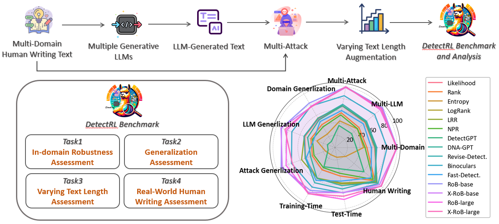

<div align=center>

</div>
<h2 align="center"> <a href="https://arxiv.org/abs/2410.23746">[NeurIPS D&B 2024] DetectRL: Benchmarking LLM-Generated Text Detection in Real-World Scenarios </a></h2>

<h5 align="center"> 

If you like our project, please give us a star ⭐ on GitHub for the latest update.  </h2>

</h5>

<div align=center>
  
[](https://arxiv.org/abs/2410.23746) 
[](https://junchaoiu.github.io/DetectEval-Home/)

This repository is the official implementation of DetectRL, a benchmark for real-world LLM-generated text detection, covers multiple realistic scenarios, including usage of various prompts, human revisions of LLM-generated text, adversarial spelling errors, taking measures to attack detectors, etc., provide real utility to researchers on the topic and practitioners looking for consistent evaluation methods.
</div>

---

## 📣 News

* ⏳⏳⏳ Our code and data are released. And we will provide a detailed manual later and submit the data and leaderboard to huggingface soon.
* `[2024.09.26]`  ✨ Our paper is accepted by **NeurIPS 2024 D&B track**.

## 🧐 Overview



Previous and current popular detection benchmarks, such as TuringBench , MGTBench, MULTITuDE, MAGE and M4, have primarily focused on evaluating detectors' performance across various domains, generative models, and languages by constructing idealized test data. However, they have overlooked the assessment of detectors' capabilities in more common scenarios encountered in practical applications, such as various prompt usages and human revisions, as shown in following table.

| **Benchmark ↓ Eval →** | Multi Domains | Multi LLMs | Various Prompts | Human Revision | Writing Errors | Data Mixing | Detector Generalization | Training Length | Test Length | Real World Human Writing |
|------------------------|---------------|------------|-----------------|------------|----------------|-------------|-------------------------|-----------------|-------------|--------------------------|
| **TuringBench**        | ✓             | ✓          | -               | -          | -              | -           | -                       | -               | -           | -                        |
| **MGTBench**           | ✓             | ✓          | -               | ⃝          | ⃝             | -           | △                       | -               | △           | -                        |
| **MULTITuDE**          | ✓             | ✓          | -               | -          | -              | -           | △                       | -               | -           | -                        |
| **M4**                 | ✓             | ✓          | ✓               | -          | -              | -           | ✓                       | -               | -           | -                        |
| **MAGE**               | ✓             | ✓          | -               | ⃝          | -              | -           | ✓                       | -               | -           | -                        |
| **DetectRL (Ours)**    | ✓             | ✓          | ✓               | ✓          | ✓              | ✓           | ✓                       | ✓               | ✓           | ✓                        |

❗Note: Comparison with existing benchmarks. $\checkmark$: benchmark evaluates this scenario. $\triangle$: has studies, not in evaluation. $\bigcirc$: similar scenario exist, but not fully based on real-world usage.


## 🏆 LeaderBoard
| **Tasks Settings →** | Multi-Domain |       | Multi-LLM |       | Multi-Attack |       | Domain-Generalization | LLM-Generalization | Attack-Generalization | Train-Time | Test-Time | Human Writing |       | AVG.  |
|----------------------|--------------|-------|-----------|-------|--------------|-------|-----------------------|--------------------|-----------------------|------------|-----------|---------------|-------|-------|
| **Detectors ↓**      | AUROC        | F1    | AUROC     | F1    | AUROC        | F1    | F1                    | F1                 | F1                    | F1         | F1        | AUROC         | F1      |       |
| **Rob-Base**         | 99.98        | 99.75 | 99.93     | 99.58 | 99.56        | 97.66 | 83.00                 | 91.81              | 92.37                 | 79.99      | 74.00     | 97.34         | 94.31 | 93.02 |
| **Rob-Large**        | 99.78        | 98.87 | 95.16     | 90.03 | 99.87        | 99.03 | 77.20                 | 82.85              | 83.96                 | 86.08      | 85.23     | 96.68         | 94.63 | 91.49 |
| **X-Rob-Base**       | 99.92        | 99.34 | 99.14     | 98.17 | 98.49        | 96.07 | 75.97                 | 92.73              | 90.58                 | 84.25      | 73.83     | 93.43         | 90.29 | 91.71 |
| **X-Rob-Large**      | 99.01        | 97.44 | 97.40     | 93.47 | 99.31        | 97.75 | 76.14                 | 85.89              | 73.42                 | 86.35      | 79.83     | 97.21         | 94.43 | 90.59 |
| **Binoculars**       | 83.95        | 78.25 | 83.30     | 74.83 | 85.05        | 78.53 | 77.47                 | 74.10              | 74.70                 | 73.82      | 74.34     | 90.68         | 85.98 | 79.61 |
| **Revise-Detect.**   | 67.24        | 60.82 | 66.36     | 53.72 | 70.89        | 57.24 | 54.50                 | 53.28              | 50.63                 | 65.71      | 67.96     | 83.29         | 82.16 | 64.13 |
| **Log-Rank**         | 64.43        | 57.53 | 63.75     | 54.18 | 68.52        | 55.15 | 55.10                 | 52.78              | 51.28                 | 57.44      | 59.74     | 88.46         | 83.85 | 62.48 |
| **LRR**              | 65.47        | 55.45 | 64.93     | 53.01 | 68.53        | 57.99 | 54.61                 | 52.73              | 57.41                 | 57.09      | 58.15     | 85.99         | 80.56 | 62.46 |
| **Log-Likelihood**   | 63.71        | 56.36 | 62.97     | 53.13 | 67.97        | 54.38 | 53.37                 | 51.77              | 50.73                 | 57.92      | 59.28     | 88.48         | 83.75 | 61.83 |
| **DNA-GPT**          | 64.92        | 55.83 | 64.36     | 51.09 | 68.36        | 53.36 | 51.51                 | 47.09              | 41.98                 | 57.63      | 62.43     | 87.80         | 82.77 | 60.70 |
| **Fast-DetectGPT**   | 58.52        | 48.07 | 59.58     | 46.55 | 60.70        | 50.63 | 48.35                 | 36.56              | 49.47                 | 61.31      | 55.08     | 76.03         | 68.47 | 55.33 |
| **Rank**             | 51.34        | 44.97 | 50.33     | 42.06 | 57.08        | 48.83 | 42.61                 | 41.49              | 38.84                 | 41.67      | 46.65     | 83.86         | 80.00 | 51.52 |
| **NPR**              | 48.37        | 41.41 | 47.27     | 40.04 | 53.49        | 45.22 | 38.58                 | 38.83              | 36.10                 | 37.60      | 42.17     | 80.03         | 75.98 | 48.08 |
| **DetectGPT**        | 34.43        | 21.52 | 34.93     | 14.80 | 36.19        | 19.15 | 11.54                 | 13.11              | 11.84                 | 35.78      | 34.69     | 60.86         | 48.76 | 29.05 |
| **Entropy**          | 46.02        | 27.40 | 46.97     | 34.25 | 43.75        | 24.69 | 25.06                 | 31.07              | 16.53                 | 13.38      | 15.99     | 22.39         | 16.60 | 28.01 |

## ⚙️ Data and Experimental Reproduction

### Data Loading and Processing
```bash
# loading original dataset and sampling
sh load_dataset.sh
```

### Data Generation and Benchmark Construction
```bash
# data generation
sh data_generation.sh

# benchmark construction
sh benchmark_construction.sh
```


### Benchmark Evaluation
```bash
# Task1 and Task2 evaluation
sh domains_evaluation.sh
sh llms_evaluation.sh
sh attacks_evaluation.sh

# Task3 evaluation
sh varying_length_evaluation.sh

# Task4 evaluation
sh human_writing_evaluation.sh
```

## ✏️ Citation

If you find our paper and code useful in your research, please consider giving a star :star: and citation :pencil:.

```BibTeX
@article{wu2024detectrl,
  title={DetectRL: Benchmarking LLM-Generated Text Detection in Real-World Scenarios},
  author={Wu, Junchao and Zhan, Runzhe and Wong, Derek F and Yang, Shu and Yang, Xinyi and Yuan, Yulin and Chao, Lidia S},
  journal={arXiv preprint arXiv:2410.23746},
  year={2024}
}
```
